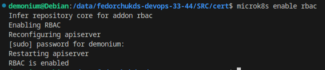
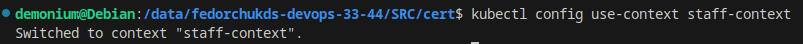

# Автор: Федорчук Дмитрий Сергеевич DEVOPS-33

# Домашнее задание к занятию «Управление доступом»

### Задание 1. Создайте конфигурацию для подключения пользователя

1. Создайте и подпишите SSL-сертификат для подключения к кластеру.
2. Настройте конфигурационный файл kubectl для подключения.
3. Создайте роли и все необходимые настройки для пользователя.
4. Предусмотрите права пользователя. Пользователь может просматривать логи подов и их конфигурацию (`kubectl logs pod <pod_id>`, `kubectl describe pod <pod_id>`).
5. Предоставьте манифесты и скриншоты и/или вывод необходимых команд.

------

### Выполнение задания 1. Создайте конфигурацию для подключения пользователя

1. Используя OpenSSL создаю файл ключа:

Создаю запрос на подписание сертификата (CSR):

Генерирую файл сертификата (CRT). Поскольку я использую Microk8s, я буду использовать ключи кластера по пути `/var/snap/microk8s/current/certs/`:

2. Настраиваю конфигурационный файл kubectl для подключения.

Создаю пользователя `staff` и настраиваю его на использование созданного выше ключа:

Создаю новый контекст с именем `staff-context` и подключаю его к пользователю `staff`, созданному ранее:

Проверю, создался ли контекст:

Контекст создался.

3. Для выполнения задания создам отдельный Namespace:

Также потребуется включение встроенного в Microk8s RBAC контроллера:

Применю манифест создания роли (Role) и манифест привязки роли к Namespace (RoleBinding):

4. Для проверки прав пользователя переключусь в его контекст:

Разверну Deployment в разрешенном для пользователя Namespace:

Проверю какие развернуты поды в Namespace с именем `default`:

Видно, что в Namespace с именем `default` нет доступа, так как он не был указан в манифесте Role.

Но если я проверю поды в Namespace с именем `access-control`, то список подов отобразится, т.к. на него есть разрешения в Role:

Также проверю логи пода:

Проверю вывод описания пода:

Согласно манифесту роли и ее привязке к Namespace, у пользователя `staff` есть доступ подам, их логам и описанию.

5. Ссылка на манифест Deployment - https://github.com/DemoniumBlack/fedorchukds-devops-33-44/blob/main/SRC/deployment.yaml

   Ссылка на манифест Role - https://github.com/DemoniumBlack/fedorchukds-devops-33-44/blob/main/SRC/role.yaml

   Ссылка на манифест RoleBinding - https://github.com/DemoniumBlack/fedorchukds-devops-33-44/blob/main/SRC/rolebinding.yaml